Genesis 1

## People

- God
- Spirit of God
- Serpent
- Adam
- Eve
- Cain
- Abel

## Content
[[#^167e5d |Genesis 1]]
[[#^c302c4 |Genesis 2]]
[[#^e0ddcf |Genesis 3]]
[[#^2a4ba8 |Genesis 4]]

----

Genesis 1

## The Account of Creation (Genesis 1 1-31)

^167e5d

### Day 1
>In the beginning, God created the heavens [^1] and earth[^2]; earth being formless and empty, darkness covered the deep waters. The Spirit of God hovering over the surface of the waters.
>God said, 

>[!quote] "Let there be light," 

>and there was light. God saw the light was good. He then separated the light from darkness. God called the light "day"[^3] and the darkness[^4] "night". Evening passed and morning came, marking the first day.

[^1]: Heavens
[^2]: Earth
[^3]: Day
[^4]: Night

>[!example] Day 1 Creations
>- Heavens
>- Earth
>- Light (Day)
>- Dark (Dark)

### Day 2
>God said, "Let there be a space between the waters, to separate the waters of the heavens from the waters of the earth." God called the space "sky."[^5] Evening passed and morning came, marking the second day.

[^5]: Sky

>[!example] Day 2 Creations
>- Space between waters of heavens and waters of earth (Sky)

### Day 3
>God said, "Let the waters beneath the sky flow together into one place, so dry ground may appear." God called the dry ground "land"[^6] and the waters "seas".[^7] God saw it was good. God said, "Let the land sprout with vegetation--every sort of seed-bearing plant, and trees that grow seed-bearing fruit. These seeds will then produce the kinds of plants and trees from which they came.” The land produced vegetation--all sorts of seed-bearing plants, and trees wit seed-bearing fruit. Their seeds produced plants and trees of the same kind.[^8] God saw that it was good, evening passed and morning came marking the third day.

[^6]: Land
[^7]: Seas
[^8]: Vegetation

>[!example] Day 3 Creations
>- dry ground (land)
>- waters -> "seas"
>- Vegetation: every sort of seed-bearing plant and trees that grow seed-bearing fruit

### Day 4
>God said, "Let lights appear in the sky to separate the day from the night. Let them be signs to mark the seasons, days, and years. Let these lights in the sky shine down on the earth." God made two great lights--the larger one to govern the day[^9], and the smaller one to govern the night[^10]. He also made the stars.[^11] God set these lights in the sky to light the earth, to govern the day and night, to separate the light from darkness. God saw that it was good, evening passed and morning came marking the fourth day.

[^9]: Sun
[^10]: Moon
[^11]: Stars

>[!example] Day 4 Creations
>- Larger great light to govern the day (Sun)
>- Smaller great light to govern the night (Moon)
>- Stars

### Day 5
>God said, "Let the waters swarm with fish and other life. Let the skies be filled with birds of every kind." God created great sea creatures[^12] and every living thing that scurries and swarms in the water,[^13] and every sort of bird--each producing offspring of the same kind.[^14] God saw that it was good. God blessed them saying, "Be fruitful and multiply. Let the fish fill the seas, and let the birds multiply on the earth." Evening passed and morning came, marking the fifth day.

[^12]: Great sea creatures
[^13]: Every living thing in the water
[^14]: Every sort of bird

>[!example] Day 5 Creations
>- Great sea creatures
>- Every living thing that scurries and swarms in the water
>- Every sort of bird--each producing offspring of the same kind

### Day 6
>God said, "Let the earth produce every sort of animal, each producing offspring of the same kind--livestock, small animals that scurry along the ground, and wild animals." God made all sorts of wild animals,[^17] livestock,[^15] and small animals,[^16] each able to produce offspring of the same kind. God saw it was good. God said, "Let us make human beings in our image, to be like us. They will reign over the fish in the sea, the birds in the sky, the livestock, all the wild animals on the earth, and the small animals that scurry along the ground." God created human beings in his own image. In the image of God he created them, male and female.[^18] 
>	God blessed them, "Be fruitful and multiply. Fill the earth and govern it. Reign over the fish in the sea, the birds in the sky, and all the animals that scurry along the ground." God said, "Look! I have given you every seed-bearing plant throughout the earth and all the fruit trees for your food. And I have given every green plant as food for all the wild animals, the birds in the sky, and the small animals that scurry along the ground—everything that has life."
>		God looked over all he had made, and saw that it was very good! Evening passed and morning came marking the sixth day.

[^15]: Livestock
[^16]: Small animals
[^17]: Wild Animals
[^18]: Human beings in His image

>[!example] Day 6 Creations
>- Livestock
>- Small animals
>- Wild animals
>- Human beings in His image

>[!tldr] Genesis 1 Summary
>God creates the heavens and earth and separates darkness and light on the first day. Light is day and darkness is night. The second day, God creates space between the waters of the heavens and waters called sky. God creates dry ground called land, the waters called seas, and vegetation.

Genesis 2

## Genesis 2: 1-4
### Day 7
>The creation of the heavens and the earth and everything in them was completed. Seventh day, God finished his work of creation, so he rested from all his work. God blessed the seventh day and declared it holy, because it was the day when he rested from all his work of creation.[^19]

^c302c4

[^19]: Holy day of rest

>[!example] Day 7
>- Holy day of rest

## The Man and Woman in Eden (Genesis 2: 4-25)

>[!note]- When the Lord God made the earth and heavens, 
>neither wild plants nor grains were growing on the earth. For the Lord God had not yet sent rain to water the earth, there were no people to cultivate the soil. Instead, springs came up from the ground and watered all the land. 

### Adam
>Then the Lord God formed the man from the dust of the ground. He breathed the breath of life into the man's nostrils, and the man became a living person.[^20]

[^20]: Man of dust (Adam)

### The Garden of Eden [[Geography#^052797]]

^7581c7

>Then the Lord God planted a garden in Eden in the east,[^21] and there he placed the man he had made. The Lord God made all sorts of trees grow up from the ground--trees that were beautiful and that produced delicious fruit. In the middle of the garden he placed the tree of life[[Geography#^5bb4cb]][^22] and the tree of the knowledge of good[[Geography#^859b68]][^23] and evil. A river flowed from the land of Eden, watering the garden then dividing into four branches. First branch: Pishon[[Geography#^3884f2]], flowed around the entire land of Havilah where there is gold, exceptionally pure gold, aromatic resin and onyx stone. Second branch: Gihon[[Geography#^e29459]], flowed around the entire land of Cush. Third branch: Tigris[[Geography#^e29459]], flowed east of the land of Asshur. Fourth branch: Euphrates[[Geography#^9615ea]]. God placed the man in Eden to tend and watch over it. God warned him, 

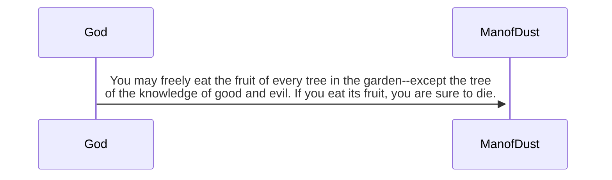

[^21]: The Garden of Eden
[^22]: Tree of life
[^23]: Tree of the knowledge of good and evil

### Eve
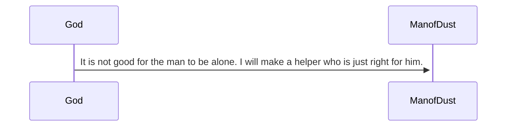
> So the Lord God formed from the ground all the wild animals and birds of the sky. He brought them to the man to see what he would call them, and the man chose a name for each one. He gave names to all the livestock, all the birds, all wild animals. Still there was no helper just right for him.[^24]
>So the Lord God caused the man into a deep sleep. While the man slept, the Lord God took out one of the man's ribs and closed up the opening. Then the Lord God made a woman from the rib, and he brought her to the man.[^25]
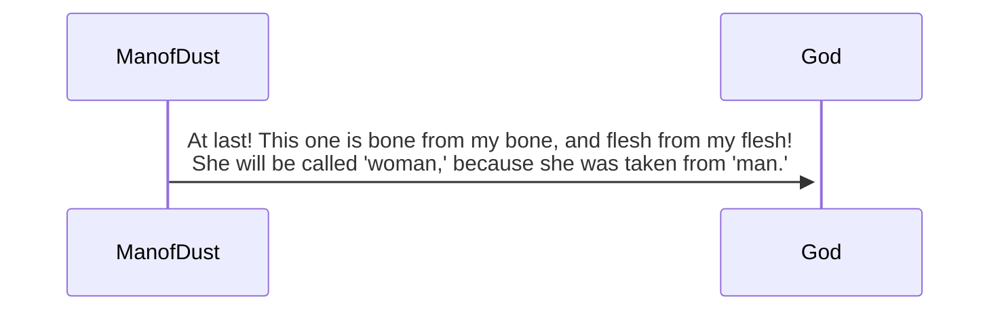
[^26]
>This explains why a man leaves his father and mother and is joined to his wife, and the two are united into one. Now the man and his wife were both naked, but felt no shame.[^27]

[^24]: Adam names all the animals
[^25]: Eve is made from one of Adam's ribs
[^26]: Difference between man and woman
[^27]: Adam and Eve naked without shame

>[!tldr] Genesis 2 Summary
>God rests on the seventh day and makes that day holy for rest. God makes springs come up from the ground to water the land and vegetation. God makes a man from dust, breathing the breath of life into him. God makes the Garden of Eden in the east, and places the man there. God makes the Tree of Life and the Tree of the knowledge of good in the middle of the garden. From Eden, a river flowed that divides into four branches: first branch is Pishon, second branch Gihon, third branch Tigris, fourth branch Euphrates. The man names all the animals. God causes the man to go into a deep sleep and takes one of his ribs. He makes a woman from the rib and brings her to the man. He names her 'woman' because she was taken from 'man'. Both the man and woman are naked without shame.

Genesis 3

## The Man and Woman Sin (Genesis 3: 1-19)
>The serpent was the shrewest of all the wild animals the Lord God had made. One day the man asked the woman, 

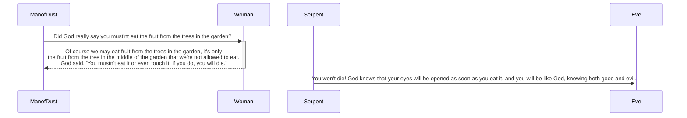

>Eve was convinced. She saw the tree was beautiful and its fruit looked delicious, she wanted the wisdom it would give her. She took some of the fruit and ate it. She gave some to her husband, who was with her and he ate it too.[^28] That moment their eyes were opened, the suddenly felt shame at their nakedness. The sewed fig leaves together to cover themselves.[^29] 
>When the cool evening breezes were blowing, both heard the Lord God walking about the garden. They hid from Him among the trees. God called to the man,

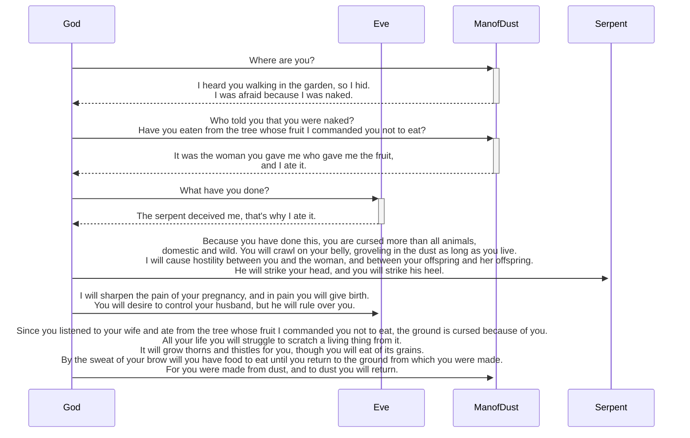

[^30]

^e0ddcf

## Paradise Lost: God's Judgment (Genesis 3: 20-24)
>Then the man--Adam--named his wife Eve, because she would be the mother of all who live. God made clothing from animal skins for Adam and his wife. God said, 

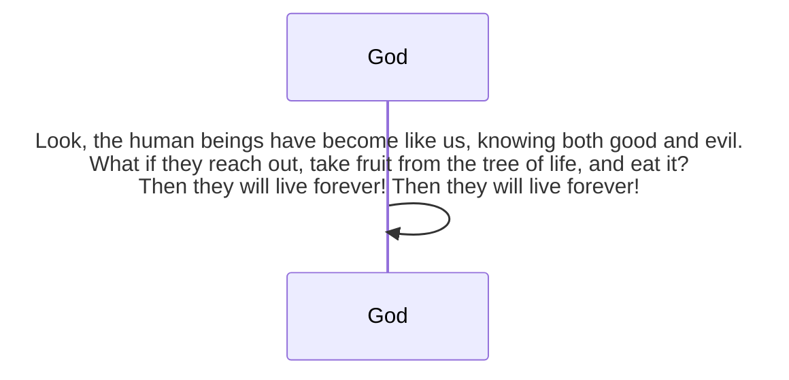

>God banished them from Eden, and sent Adam out to cultivate the ground from which he had been made. After sending out Adam, God stationed mighty cherubim to the east of the Garden of Eden. He placed a flaming sword that flashed back and forth to guard the way to the tree of life.

[^28]: Eve eats the fruit and makes Adam eat the fruit too.
[^29]: Both felt shame of their nakedness and cover themselves
[^30]: Adam hides from God because of his fear from being naked

>[!tldr] Genesis 3 Summary
>Eve is convinced by the serpent to eat the forbidden fruit and makes Adam eat some too. After eating the fruit, both Adam and Eve felt shame from being naked and covered themselves. Adam hides from God because he was afraid from being naked. God curses the serpent most than all animals to crawl on his belly and hostility between humans. Women's pregnancy pain is sharpened and they will desire to control man but he will rule over them. The ground is cursed because of Adam listening to Eve and will have to live off the grains of the earth .

Genesis 4

## Cain and Abel
>Adam had sexual relations with his wife, Eve, and she became pregnant. She gave birth to Cain saying, 

^2a4ba8

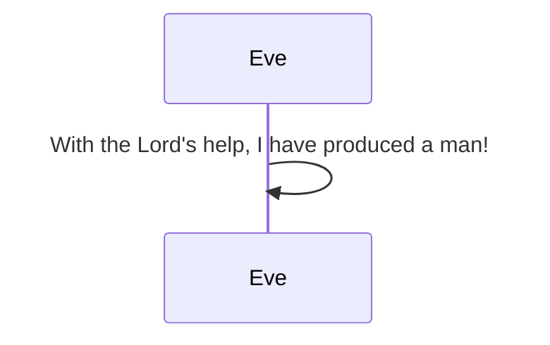

>Later she gave birth to his brother named Abel. When they grew up, Abel became a shepherd, Cain cultivated the ground. When it was time for harvest, Cain presented some crops as a gift to the Lord. Abel also brought a gift--the best portions of the firstborn lambs from his flock. The Lord accepted Abel and his gift, but not Cain and his gift. This made Cain very angry and looked dejected. God asks Cain, 

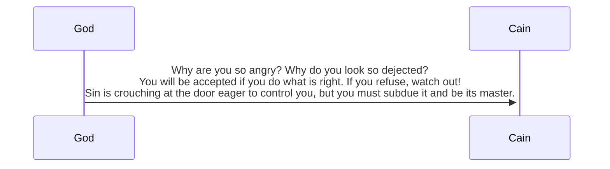

### Cain kills Abel
>One day Cain suggests his brother, 

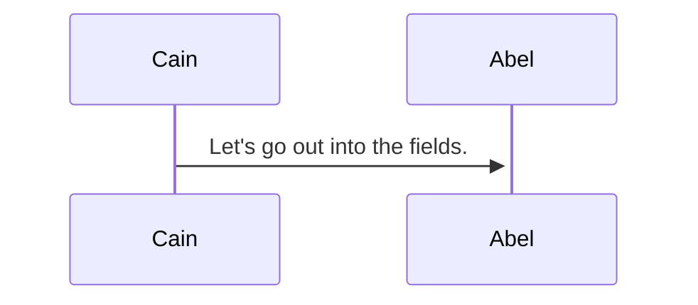

>While they were there, Cain attacks his brother, and kills him. The Lord asked, 

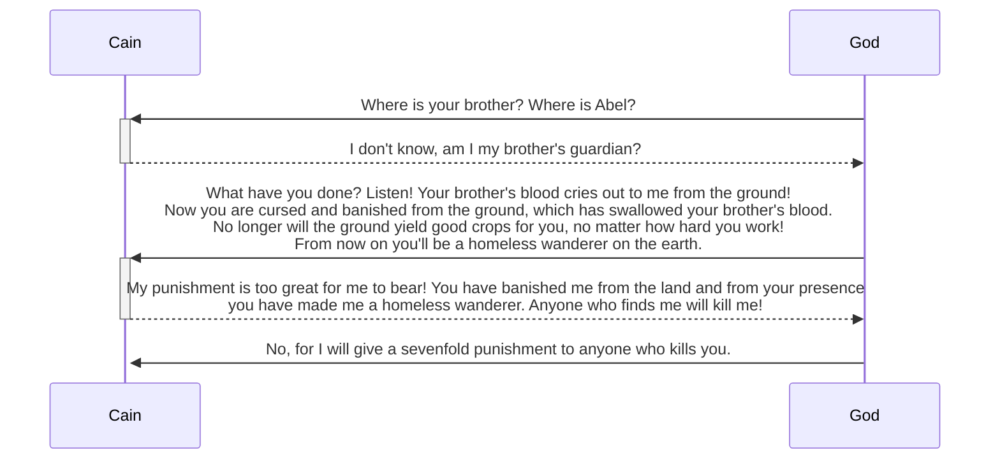

>The Lord put a mark on Cain to warn anyone who might try to kill him. Cain left the Lord's presence and settled in the land of Nod[[Geography#^59881d]], east of Eden.

### The Descendants of Cain
>Cain had sexual relations with his wife, she became pregnant and gave birth to Enoch. Cain founded a city, he named Enoch, after his son. Enoch had a son named Irad. Irad became father of Mehujael. Mehujael became father of Methushael. Methushael became father of Lamech. Lamech married two women, first Adah, second Zillah. Adah gave birth to Jabal, first of those who raise livestock and live in tents. Brother's name was Jubal, first of all who play harp and flute. Lamech's other wife Zillah gave birth to son Tubal-cain. He became an expert in forging tools of bronze and iron. Tubal-cain had a sister named Naamah. One day Lamech said to his wives, 

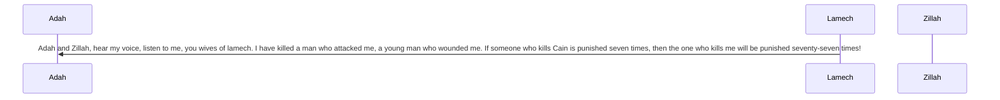

### The Birth of Seth
>Adam had sexual relations with Eve again, she gave birth to Seth.
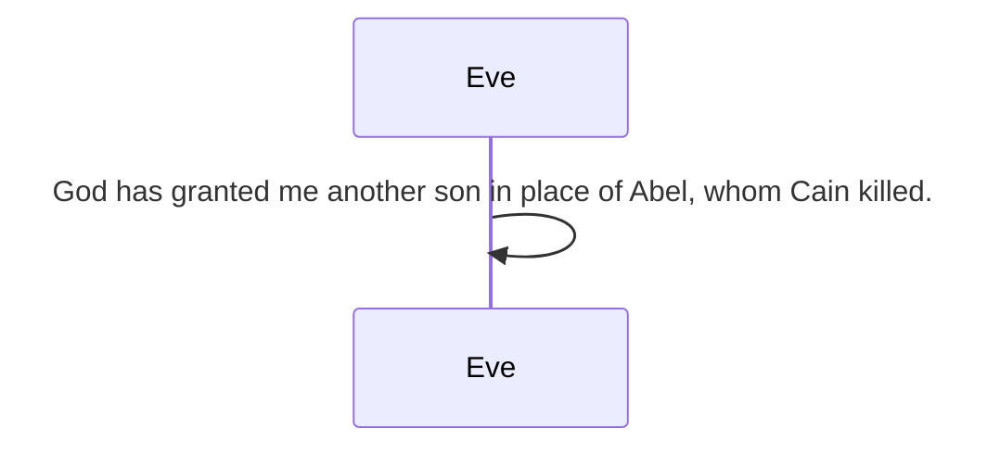
>When Seth grew up, he had a son named Enosh. At that time people first began to worship the Lord by name.

Genesis 5

### The Descendants of Adam (Genesis 5: 1-32)
>The written account of the decendents of Adam. God made human beings to be like Himself. When Adam was 130 years old, he became a father of a son just like him--in his image. His sons name was Seth. Adam lived another 800 years, he had other sons and daughters. Adam lived 930 years, then he died. Seth was 105 years old, became the father of Enosh. After Enosh, Seth lived another 807 years, he also had other sons and daughters. Seth lived 912 years then died. Enosh was 90 years old when he became the father of Kenan. Enosh lived another 815 years after birth of Kenan. Enosh lived 905 years then died. Kenan was 70 years and became father of Mahalalel. He lived another 840 years afterr. Kenan lived 910 years then died. Mahalalel 65 years old, became father of Jared. Lived another 830 years, lived 895 years then died. Jared 162 years old, became father of Enoch, lived another 800 years. 962 then died. Enoch 65 years old, father of Methuselah, lived in close fellowship with God for another 300 years. Enoch lived 365 years then one day disappeared because God took him. Methuselah was 187 years old, father of Lamech, after he lived another 782 years. 969 years then died. Lamech was 182, father of Noah, after lived another 595 years. Lived 777 years then died. Noah 500 years old, became father of Shem, Ham, and Japeth.

Genesis 6

### A World Gone Wrong
>People began to multiply on earth. The Lord observed the extent of human wickedness on the earth, and he saw that everything they thought or imagined was consistently and totally evil. So the Lord was sorry he had ever made them and put them on the earth. It broke his heart. And the Lord said, “I will wipe this human race I have created from the face of the earth. Yes, and I will destroy every living thing—all the people, the large animals, the small animals that scurry along the ground, and even the birds of the sky. I am sorry I ever made them.” But Noah found favor with the Lord.

### The Story of Noah
>Noah was righteous man, only blameless person living on earth at the time, he walked in close fellowship with God. Father of three sons: Shem, Ham, Japheth. God said to Noah, "I have decided to destroy all living creatures, for they have filled the earth with violence. Yes, I will wipe them all out along with the earth! Build a large boat from cypress wood and waterproof it with tar, inside and out. Then construct decks and stalls throughout its interior. 15Make the boat 450 feet long, 75 feet wide, and 45 feet high. Leave an 18-inch opening below the roof all the way around the boat. Put the door on the side, and build three decks inside the boat—lower, middle, and upper. Look! I am about to cover the earth with a flood that will destroy every living thing that breathes. Everything on earth will die. But I will confirm my covenant with you. So enter the boat—you and your wife and your sons and their wives. Bring a pair of every kind of animal—a male and a female—into the boat with you to keep them alive during the flood. Pairs of every kind of bird, and every kind of animal, and every kind of small animal that scurries along the ground, will come to you to be kept alive. And be sure to take on board enough food for your family and for all the animals.” So Noah did everything exactly as God had commanded him.

Genesis 7

### The Flood Covers the Earth (Genesis 7: 1-24)
>When everything was ready, God said to Noah, “Go into the boat with all your family, for among all the people of the earth, I can see that you alone are righteous. Take with you seven pairs—male and female—of each animal I have approved for eating and for sacrifice, and take one pair of each of the others. Also take seven pairs of every kind of bird. There must be a male and a female in each pair to ensure that all life will survive on the earth after the flood. Seven days from now I will make the rains pour down on the earth. And it will rain for forty days and forty nights, until I have wiped from the earth all the living things I have created.”
>Noah was 600 years when the flood covered the earth. On the seventeenth day of the second month, all underground waters erupted from the earth, the rain fell mighty torrents from the sky. Rain continued to fall for forty days and nights. The floodwaters covered the earth for 150 days.

Genesis 8

### The Flood Recedes
>God sent a wind to blow across the earth, the floodwaters began to recede. After 150 days, exactly 5 months from the flood began, the boat came to rest on the mountains of Ararat. 2.5 months later, other mountain peaks became visible.

Genesis 10

>The account of the families of Shem, Ham, and Japheth.

### Descendants of Japheth
>Descendants of Japheth were Gomer, Magog, Madai, Javan, Tubal, Meshech, and Tiras. Descendants of Gomer were Ashkenaz, Riphath, and Togarmah. Descendants of Javan were Elishah, Tarshish, Kittim, and Rodanim. Their descendants became the seafaring peoples that spread out to various lands, each identified by its own language, clan, and national identity.

### Descendants of Ham
>Descendants of Ham: Cush, Mizraim, Put, and Canaan. Descendants of Cush: Seba, Havilah, Sabtah, Raamah, and Sabteca. Descendants of Raamah: Sheba and Dedan. Cush was the ancestor of Nimrod, the first heroic warrior on earth. His name became proverbial. Cush built his kingdom in Babylonia, with the cities Babylon, Erech, Akkad, and Calneh. From there he expanded his territory to Assyria, building the cities of Nineveh, Rehoboth-ir, Calah, and Resen(great city located between Nineveh and Calah). Mizraim was ancestor of the Ludites, Anamites, Lehabites, Naphtuhites, Pathrusites, Casluhites, and the Caphtorites, from whom the Philistines came. Canaan's oldest son was Sidon, ancestor of the Sidonians. Canaan was ancestor of Hittites, Jebusites, Amorites, Girgashites, Hivites, Arkites, Sinites, Arvadites, Zemarites, and Hamathites. The Canaanite clans spread out, the territory of Canaan extended from Sidon in the north to Gerar and Gaza in the south, and east as far as Sodom, Gomorrah, Admah, and Zeboiim, near Lasha. These were the descendants of Ham, identified by clan, language, territory, and national identity.

### Descendants of Shem
>Sons were born to Shem, older brother of Japheth. Shem was ancestor of all descendants of Eber. Descendants: Elam, Asshur, Arphaxad, Lud, and Aram. Descendants of Aram: Uz, Hul, Gether, and Mash. Arphaxad was father of Shelah, and Shelah was father of Eber. Eber had two sons: Peleg(means"division") during his lifetime people of the world were divided into different language groups. His brother's name was Joktan. Joktan ancestor of Almodad, Sheleph, Hazarmaveth, Jerah, Hadoram, Uzal, Diklah, Obal, Abimael, Sheba, Ophir, Havilah, Jobab. all were descendants of Joktan. The territory they occupied extended from Mesha all the way to Sephar in the eastern mountains. Descendants of Shem identified by clan, language, territory and national identity.

Genesis 11

### The Tower of Babel
>As people migrated east, found a plain in the land of Babylonia and settled there. “Come, let’s build a great city for ourselves with a tower that reaches into the sky. This will make us famous and keep us from being scattered all over the world.” But the Lord came down to look at the city and the tower the people were building. “Look!” he said. “The people are united, and they all speak the same language. After this, nothing they set out to do will be impossible for them! Come, let’s go down and confuse the people with different languages. Then they won’t be able to understand each other.” In that way, the Lord scattered them all over the world, and they stopped building the city. That is why the city was called Babel, because that is where the Lord confused the people with different languages.

### The Line of Descent from Shem to Abram
>Account of Shem's family. 2 years after great flood, when Shem 100 years old, became father of Arphaxad. After his birth, Shem lived another 500 years. Arphaxad 35 years old became father of Shelah. After his birth Arphaxad lived another 403 years. Shelah 30 years old became father of Eber. After Eber 34 years old became father of Peleg. Eber lived another 430 years. Peleg 30 years old became father of Reu, after lived another 209 years. Reu 32 years old became father Serug, after lived another 207 years. Serug 30 years old became father of Nahor, after lived another 200 years. Nahor 29 years old became father of Terah, after lived another 119 years. Terah 70 years old became father of Abram, Nahor, and Haran.

### The Family of Terah
>Account of Terah's family. Terah father of Abram, Nahor Jr, Haran, Haran father of Lot. Haran died in Ur of the Chaldeans, land of his birth, while his father was still living. Abram and Nahor Jr both married. Name of Abram's wife, Sarai, name of Nahor's wife, Milcah(her and her sister Iscah were daughters of Nahor's brother Haran). Sarai was unable to become pregnant.
>Terah took Abram, daughter-in-law Sarai, grandson Lot, moved away from Ur of the Chaldeans. Headed for the land of Canaan but stopped at Haran and settled there. Terah lived 205 years died while still in Haran.

Genesis 12

### The Call of Abram
>The Lord had said to Abram, “Leave your native country, your relatives, and your father’s family, and go to the land that I will show you. I will make you into a great nation. I will bless you and make you famous, and you will be a blessing to others. I will bless those who bless you and curse those who treat you with contempt. All the families on earth will be blessed through you.”
>Abram departed as instructed and Lot went with him. Abram ~75 years old when he left Haran. Abram took his wife Sarai, nephew Lot, and all his wealth, livestock, and people in his household at Haran and headed for land of Canaan. When arrived, Abram traveled through land as far as Shechem. Set up camp beside oak of Moreh. At that time the area was inhabited by Canaanites. Abram built an altar dedicated to the Lord. Abram continued traveling south by stages toward Negev.

### Abram and Sarai in Egypt
>At that severe time famine struck land of Canaan, forcing Abram to go down to Egypt where he lived as a foreigner.

Genesis 13

### Abram and Lot Separate
>Abram left Egypt and traveled north into Negev, along with Sarai and Lot. From Negev, they continued traveling by stages toward Bethel, pitched their tents between Bethel and Ai. Same place where Abram built the altar, there he worshiped Lord again. Canaanites and Perizzites living in the land. 