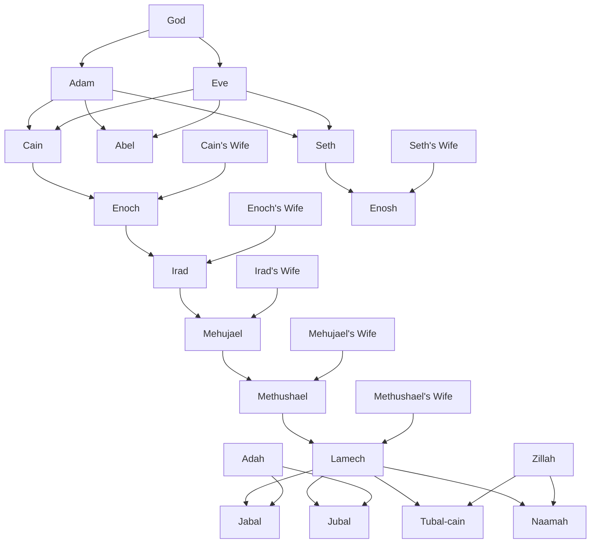
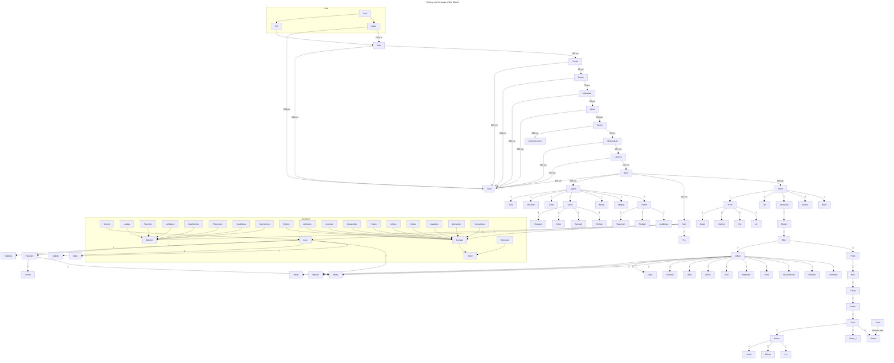
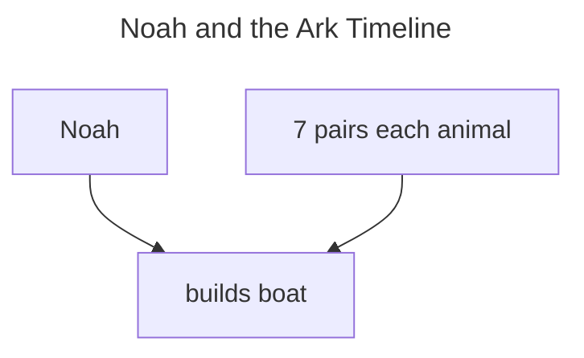
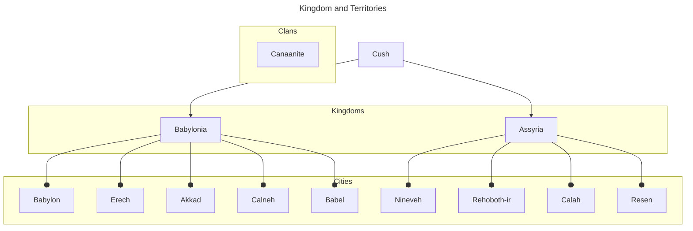

Timeline

Timeline and Family Tree

```mermaid
graph TB;
	A[God] --> B[Adam];
	A[God] --> C[Eve];
	B --> D[Cain];
	C --> D;
	B --> E[Abel];
	C --> E;
	D --> G[Enoch]
	F[Cain's Wife] --> G
	G --> I[Irad]
	H[Enoch's Wife] --> I
	I --> K[Mehujael]
	J[Irad's Wife] --> K
	K --> M[Methushael]
	L[Mehujael's Wife] --> M
	M --> O[Lamech]
	N[Methushael's Wife] --> O
	O --> Q[Jabal]
	P[Adah] --> Q
	O --> R[Jubal]
	P --> R
	O --> T[Tubal-cain]
	S[Zillah] --> T
	O --> U[Naamah]
	S --> U
	B --> V[Seth]
	C --> V
	V --> X[Enosh]
	W[Seth's Wife] --> X
class A,B,C,D,E,F,G,H,I,J,K,L,M,N,O,P,Q,R,S,T,U,V,W,X,Y,Z internal-link;
```

```mermaid
---
title: History and Lineage of the World
---
flowchart TB
	subgraph God
	id1[God] --o Adam & Eve
	end
	Adam--o|130 y.o.|Seth
	Eve--o Seth
	Adam--x|930 y.o.|a[\Dead/]
	Seth--o|105 y.o.|Enosh
	Seth--x|912 y.o.|a
	Enosh--o|90 y.o.|Kenan
	Enosh--x|905 y.o.|a
	Kenan--o|70 y.o.|Mahalalel
	Kenan--x|910 y.o.|a
	Mahalalel--o|65 y.o.|Jared
	Mahalalel--x|895 y.o.|a
	Jared--o|162 y.o.|Enoch
	Jared--x|962 y.o.|a
	Enoch--o|65 y.o.|Methuselah
	Enoch--x|300 y.o.|b["God took them"]
	Methuselah--o|187 y.o.|Lamech
	Methuselah--x|969 y.o.|a
	Lamech--o|182 y.o.|Noah
	Lamech--x|777 y.o.|a
	Noah--o|500 y.o.|Shem & Ham & Japeth
	Ham--o|?|Canaan & Cush & Mizraim & Put
	Noah--x|950 y.o.|a
	Japeth--o|?|Gomer & Magog & Madai & Javan & Tubal & Meshech & Tiras
	Gomer--o|?|Ashkenaz & Riphath & Togarmah
	Javan--o|?|Elishah & Tarshish & Kittim & Rodanim
	Cush--o|?|Seba & Havilah & Sabtah & Raamah & Sabteca
	Raamah--o|?|Sheba & Dedan
	Canaan--o Sidon
	Shem--o|?|Elam & Asshur & Arphaxad & Lud & Aram
	Aram--o|?|Uz & Hul & Gether & Mash
	Arphaxad--o|?|Shelah
	Shelah--o|?|Eber
	Eber--o|?|Peleg & Joktan
	Peleg--o|?|Reu
	Reu--o|?|Serug
	Serug--o|?|Nahor
	Nahor--o|?|Terah
	Terah--o|?|Abram & Nahor_jr & Haran
	Joktan--o|?|Almodad & Sheleph & Hazarmaveth & Jerah & Hadoram & Uzal & Diklah & Obal & Abimael & Sheba & Ophir & Havilah & Jobab
	Haran--o|?|Lot
	Sarai--o|"Abram's wife"|Abram
	Haran--o|?|Milcah & Iscah
	subgraph Ancestors
	Nimrod--o Cush
	Ludites--o Mizraim
	Anamites--o Mizraim
	Lehabites--o Mizraim
	Naphtuhites--o Mizraim
	Pathrusites--o Mizraim
	Casluhites--o Mizraim
	Caphtorites--o Mizraim
	Sidonians--o Sidon
	Hittites--o Canaan
	Jebusites--o Canaan
	Amorites--o Canaan
	Girgashites--o Canaan
	Hivites--o Canaan
	Arkites--o Canaan
	Sinites--o Canaan
	Arvadites--o Canaan
	Zemarites--o Canaan
	Hamathites--o Canaan
	end
```

```mermaid
---
title: Noah and the Ark Timeline
---
flowchart TB
Noah--> b["builds boat"]
c["7 pairs each animal"]-->b
```

```mermaid
---
title: Kingdom and Territories
---
flowchart TB
Cush--> Babylonia & Assyria
subgraph Clans
Canaanite
end
subgraph Kingdoms
Babylonia
Assyria
end
subgraph Cities
Babylonia--o Babylon
Babylonia--o Erech
Babylonia--o Akkad
Babylonia--o Calneh
Babylonia--o Babel
Assyria--o Nineveh
Assyria--o Rehoboth-ir
Assyria--o Calah
Assyria--o Resen
end
```
